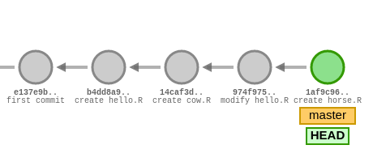

# Git and Github

## What is git?

Git is program used for version control, and is an essential skill for anyone wanting to delve into software development of any kind. What we mean with version control is different versions of code, how multiple people can work on and collaborate to write code together, and how the work of multiple people can be merged together into one single project in a well-defined manner. Git (and its other version control counterparts) have a bit of a learning curve, and requires you to slightly adjust your regular workflow.

In this course you will learn how to use git and Github to manage your own code, you will learn the basic workflow of letting git document any changes you make to your code and make it available to anyone through Github. First of all: what is the difference between Git and Github?

[Git](https://git-scm.com/) is a free and open source program that you run on your computer, you let it know when you have made some changes to your code, it documents those changes along with a message of your choice. More on how to do this in a bit.

[Github](https://www.github.com/) is a website that hosts code and projects, in this course you will use github to host your code for you, and you use Git to upload your code there.

First, check if you already have git installed by typing `git` in a terminal. If you haven't, install [git](https://git-scm.com/) through their website, or your favorite package manager. On a windows machine we recommend you install [git bash](https://gitforwindows.org/), it comes bundled with git. 

Secondly, make an account on [Github](https://www.github.com/) and follow the [guide for how to generate and add SSH keys](https://docs.github.com/en/authentication/connecting-to-github-with-ssh). This lets you easily and securely authenticate yourself to Github and push your code changes through git.

## Setting up git

To start using git, navigate to a folder where you want to your project root to be and type `git init`.

Example:

```
$ mkdir my_first_repo
$ cd my_first_repo
$ git init
Initialized empty Git repository in /home/user/my_first_repo/.git/
```

::: {.warning}
#### Warning:  
Depending on your installed version of git, you will likely be met with a warning message regarding the "default branch name" the first time you run `git init`, there is an ongoing change within the git community to rename the default branch from `master` to, usually, `main`. We recommend you run the `git config --global init.defaultBranch main` command, which will switch your default branch name to `main` for all future projects and suppress the warning. If you did run `git init` before reading this, you should also run `git branch -m main` to swap the name for this repository you just created.
:::

## Some terminology

Git has a very exact terminology for things that we talk about in everyday software development. It greatly helps to learn these words and their meanings so we all know what we are talking about. Here we are going to go over some of the words that git uses.

* Working tree / Working directory  
These are your local files, on your computer. You can think of your working tree as, what you see if you open up your project in a file browser.

* Repository  
A repository is your working tree **and** the entire history of all changes ever made that were recorded with git. Typically you differentiate between your "local repository" and your "remote repository". Each user that is working on a group project has their own copy of the repository, their own "local repository". And collectively they have one "remote repository", typically hosted on a service such as Github, that they all synchronize their changes through. 
  
* Remote  
A remote is a service/server where your code can be hosted, such as github. You have to specify a remote in Git, so it knows where to upload your code, and where to download other peoples' changes from.

* Branch  
You don't have to worry about this one, move on.

* Staging area  
After you have made some changes to one or more files in your working tree, you'll need to tell git what changes you want recorded. You do this by adding the changed files to the staging area (this process is also called "to stage files"). Files aren't modified or moved in your working tree when you stage them, they are just "moved to the stage" in git's internal view of your working tree.

* Commit  
You can think of a commit as one of two things, a set changes, or a point in time of your code development. Both of these are correct, and together they explain what a commit is.  
A commit will always include all of the changes to all your files that you have added to the staging area, since your last commit. In the figure below, each commit is shown as a circle, the right-most green circle is the most current commit. All commits are given a "commit hash", the seemingly random numbers and letters under each commit. These are actually 40 characters long, but are usually referred to using only the first 7 characters. Each commit also has a short message that summarizes what is in the commit. The arrows show which commit depends on which, not the direction of "time".
```{r, echo = FALSE, out.width = 460, out.height = 200, fig.align = 'center'}

```
  
## The basic workflow
Now that you have made a local git repository and have learnt some of the commonly used words in git, lets create a file and document our first change.

```
$ echo "this file is amazing" > amazing.txt
$ git add amazing.txt
$ git commit -m "create an amazing file"
```

Let's break down what we just did:

* `echo "this file is amazing" > amazing.txt`  
  Create a file that contains the text `this file is amazing`. So far so good.
  
* `git add amazing.txt`  
All commands in git start with `git`, and then follows another command optionally followed by a file, and/or some options. `git add` is the command that moves a file to the staging area. Here we are saying to git: "The file `amazing.txt` has been changed (or created, in this case), I want that to be included in my next commit".  
If you have made changes to several files that you want to include in the same commit, you simply run `git add` for each file, or you can give the command a wildcard in the file name to include multiple files without running the command many times, for example, `git add *.R` would include every file that has the extension `.R`, in this folder. You can also use `git add path/to/some/folder` to include everything inside a folder (every file and sub-folder) in a commit. 


* `git commit -m "create an amazing file"`  
This command takes all files in the staging area, and makes a commit out of them. The `-m` option is used to include a short, descriptive message that summarizes the changes that this commit includes.

The first time you run `git commit` you will likely be met with another one-time error message. In order for git to create your commit you must sign it with your name and email. Go ahead and run the two lines that git hints at in the error message so git knows what name and email to sign your commits with.

```
$ git config --global user.email "you@example.com"
$ git config --global user.name "Your Name"
```

This will save your name and email to the global git config file (global, as in: it affects every user on your computer, not the whole planet), you can edit it at anytime with the command `git config --global -e`, or by running the above commands again. Any future repositories that you create on your computer will use the name and email in this file to sign your commits. Once you have done this, run `git commit` again to actually create the commit.

:::{.warning}
#### About `git add .` and `git add -A`  
Git gives you the option to add every single modified file in your working tree to a commit by either specifying `.` (the folder you are currently in, which most of the time is the project root) as the file path, or with the `-A` option.

#### **You are highly discouraged from ever doing this.**  
It is considered very bad practice to add every file, instead of specifying files manually. You might add sensitive files, files that are very large and clutter the remote repository, or include changes that are irrelevant to the commit or break the current state of the project for every other person working on it.
:::

## The `git status` command

`git status` is an incredibly useful command when using and learning git. It will show you which state you are currently in, which files are staged and not staged, how many commits ahead or behind you are. Let's see what the state of our repository is after we have made our previous commit.

```
$ git status
On branch main
nothing to commit, working tree clean
```

The command first tells us that we are on the branch `main`, as we said earlier, you don't have to worry about what this means.
Secondly, it tells us that there is nothing to commit and that the working tree is clean. Makes sense, we just made a commit with all the changes we made (creating the `amazing.txt` file) and haven't done any changes since.

Let's make a change to our `amazing.txt` file and see what  `git status` tells us.

```
$ echo "more amazing text" >> amazing.txt
$ git status
On branch main
Changes not staged for commit:
  (use "git add <file>..." to update what will be committed)
  (use "git restore <file>..." to discard changes in working directory)
	modified:   amazing.txt

no changes added to commit (use "git add" and/or "git commit -a")
```

Now, git recognizes that `amazing.txt` has been changed, but tells us that we haven't added those changes to the stage, and gives us some familiar hints on how to use `git add`.
It also tells us that the next commit is, so far, empty.

Let's run `git add` and see what  `git status` returns.

```
$ git add amazing.txt
$ git status
On branch main
Changes to be committed:
  (use "git restore --staged <file>..." to unstage)
	modified:   amazing.txt
```

Now git shows us that the changes have been staged, and are ready to be committed. Should you here realize that you don't want those changes in this commit, git also gives us a hint on how `git restore` works. We haven't mentioned `git restore` before, it's basically the opposite of `git add`, instead of adding a file to the stage, it removes it from the stage. Again, the contents of the file are untouched by git, it's just git's view of your working tree that is changed.

Let's make a commit to return to the stage we were in before this section.

```
$ git commit -m "add more amazingness"
```

Familiarizing yourself with `git status` is immensely useful and we recommend that you run `git status` in between every git command you type during this course.

## Git with a remote

So far we have only worked with git locally, our files have never left our working tree.

The two main commands to interact with a remote (such as a repository hosted on Github), are `git push` and `git pull`.

Try typing `git push` and see what happens.

```
$ git push
fatal: No configured push destination.
Either specify the URL from the command-line or configure a remote repository using

    git remote add <name> <url>

and then push using the remote name

    git push <name>
```

Git gives us an error message because we haven't specified where our remote is, yet.

We will go back to this in a moment, but first, let's create our remote. Go to Github and create a new repository [here](https://github.com/new). You will use this repository for the rest of the course. You can give it any name you want, but we recommend something like `R-Programming-2`. You can leave it to be public, in which case it will be visible to anyone on the internet, or make it private so only you, and anyone you invite to the repository can view it.

After this, you will be redirected to a page with a lot of text and git commands. Hopefully at this point, some of them are familiar to you! 

We have already made a repository locally, but let's start with a fresh one for this part. Make a new folder named the same thing as your repository and follow the code in the first box. You don't *have* to name the folder the same thing as the remote repository, it's just good practice.

```
$ mkdir R-Programming-2
$ cd R-Programming-2
$ echo "# R-Programming-2" >> README.md
$ git init
$ git add README.md
$ git commit -m "first commit"
$ git branch -M main
$ git remote add origin git@github.com:<YOURNAME>/R-Programming-2.git
$ git push -u origin main
```

The last two commands are the ones we haven't covered yet. `git remote` adds a new remote (the repository on github) with the name `origin` (the default name for this kind of usage of git) and then there is a long URL, swap out `<YOURNAME>` with your github username.

Finally, we use `git push` to upload our changes (the creation of the `README.md` file) to the remote we just named `origin`, on the branch `main`. There's a lot of new words in this section, but you don't have to worry about what they mean exactly for now. Just know that the first time you run `git push` in a new repository, you have to specify the remote with `git remote` and run `git push` with the `-u origin main` option to save it as something called the "upstream". For all future commits that you want to push, it's enough to run only `git push`.

Whenever there are changes made by anyone else working in the same repository, you can download those changes with `git pull`. In this course however, you will be working alone in your repository.

## Further reading

There is *a lot* more that git can do that we haven't covered in this version control crash course. If you have time, you can familiarize yourself with the more advanced concepts of git here.

Click on a word to expand.

<details>
  <summary>
    `git clone`
  </summary>
  Downloading a repository is often called "cloning" the repository, because the command to do so is `git clone <url>`. Anyone can clone any public repository on Github (or similar websites), but you need special permissions to be able to `push` any commits back up to the repository.
</details>

<details>
  <summary>
    `head` and `git checkout`
  </summary>
  Git keeps track of where your working tree is in relation to the repository by using something calls `heads`. A `head` is basically a pointer to a specific commit. Confusingly, the `head` that your working tree is at at any time, is named `HEAD`, in all caps. You can move your working tree's `head` (the one named `HEAD`) using `git checkout <commit hash>`. This will make git backtrack through its history and change the files in your working tree to exactly what they were when the commit you entered was made. To go back to the most current state of the repository, use `git checkout <branch name>`.
</details>

<details>
  <summary>
    `git checkout <file>`
  </summary>
  This command will overwrite `<file>` with the version that was in the last commit. Useful if you accidentally deleted a file and need it back, or are unhappy with some changes and want the old version again. Note that this command **cannot be undone**.
</details>

<details>
  <summary>
    Branches
  </summary>
  Branches are a key concept in working with multiple people in the same project. A branch is a lot like a brand new copy of the repository, that you can commit changes to without it affecting the main branch. Finally, you would merge the newer branch back into the main branch. You can swap to a new branch using `git branch <branch name>` and then `git checkout <branch name>`. Any commits you make after this will not be visible to anyone on the main branch, or any other branch. There is no limit to how many branches might exist at any point, and branches don't have to all originate from the main branch, they could be a branch from a branch (and so on).
  
  Once all work is done on a branch, you merge it back by switching to the branch you want to merge *into*, say we want to merge the branch `new_branch` into the branch `main`, you would run `git checkout main` and `git merge new_branch`.
  
  The most common use case for branches is for developers to create their own little safety bubble where the commits of others working on the same project can not break their code they are working on, and they can not risk breaking anyone else's code.
  Typically in larger projects, anytime a developer starts working on a new feature, they will create a branch for it, implement said feature on their new branch, and then merge it back into the main branch.
  
  Each branch has its own `head`, with the name that you named the branch. You can interact with these `heads` using `git checkout` and `git reset`, but be aware that this can permanently delete commits.
</details>

<details>
  <summary>
    Forks and pull requests
  </summary>
  A common feature that is used in the world of git is forking a repository. Forking a repository is basically downloading a copy of someone else's repository, and then uploading that copy under your account, as a new repository marked as a fork. This is a common way for developers to create features or fix bugs in open source software, when they don't have the permissions to push commits directly to the original repository.
  
  Once a feature or bug fix has been done in a forked repository, the developer will make what is called a "pull request" in the original repository. This is a request for the developers in the original repository to pull the changes that were made in the fork. This is typically also done through "issues", which are concerns or feature requests that users or developers can make through a forum-like part of websites like Github. Pull requests can be directly linked, viewed, discussed, approved, and merged through the issue tracker.
</details>

<details>
  <summary>
    `git reset`
  </summary>
:::{.warning}
  **Always make at least one backup before running `git reset`.**
:::
`git reset` is a very powerful, and potentially, very destructive command. It has no confirmation and can delete your files and commits when used. You can use `git reset <file>` to unstage a file, this is similar to `git restore --staged <file>` and does not change the contents of the file.

Using `git reset <commit hash>` will move your `HEAD` **and your branch's** `head` to that commit. **This will delete any commits made after the commit you reset to from git's history. This can not be undone or recovered from if you have not pushed those commits to a remote**. Using `git push` after using `git reset` this way will **overwrite the remote repository, deleting the commits from the remote**. This is useful if you need some commits deleted from the history because you pushed sensitive files that should not be public, but incredibly damaging when used the wrong way.
</details>

<details>
  <summary>
    `git show` and `git log`
  </summary>
  Both these commands show the recent history in your local repository. `git show` will show what was in the most recent commit. `git show --online` is convenient if you need the last commit hash for example. `git log` will show the last 5 commits in a shorter format. If you want this formatted in a nicer way, we recommend you run 
```
$ git config --global alias.hist "log --pretty=format:'%C(yellow)[%ad]%C(reset) %C(green)[%h]%C(reset) | %C(red)%s %C(bold red){{%an}}%C(reset) %C(blue)%d%C(reset)' --graph --date=short"
```

This configures a new git command `git hist` which summarizes each commit with pretty colours, and displays all branches with some nice lines.
</details>

<details>
  <summary>
    `git stash`
  </summary>
  Whenever you merge changes from someone else, you will likely run into some merge conflicts. Whenever two people have commits that contain changes to the same parts of the same file, git won't always know what to do. There are two versions of this file that git considers equally "new". Before you merge a branch, it is useful to stage your files, and run `git stash`, this will change the files in your working tree. Git will rollback the tracked files to the version they were at the last commit, you can then `git pull` someone's changes and then use `git stash pop` to resolve the conflicting files locally, and commit the updated changes.
</details>

<details>
  <summary>
    Credential managers
  </summary>
  Depending on your system and setup, you might have access to some credential manager that can save your password for each session. You can type `git config --global credential.helper manager` or `git config --global credential.helper cache` to use these.
</details>

<details>
  <summary>
    Using git from a GUI.
  </summary>
  GUI stands for graphical user interface, and is sometimes used to refer to "any program that isn't run through only a terminal". The author of this part of the course is a grumpy and stubborn old fart that refuses to use git from anything that isn't a terminal. As you are still learning, there is still hope for you. There are plenty of free git GUI clients available, like [GitKraken](https://www.gitkraken.com/), [GitHub Desktop](https://desktop.github.com/) or [SourceTree](https://www.sourcetreeapp.com/) to name a few. If you are feeling like the terminal isn't for you, we encourage you to experiment with these and find one you like.
  
  Note that using a GUI client doesn't mean you can not use the terminal also, you can always open your local repository and execute commands from a terminal and then return to the GUI and keep working from there.
</details>

<details>
  <summary>
    Useful links
  </summary>
  [Official git documentation](https://git-scm.com/doc)  
  [Git visualiser](https://git-school.github.io/visualizing-git/)  
  [Codecademy git tutorial](https://www.codecademy.com/learn/learn-git)  
  [A more technical tutorial](https://www.cduan.com/technical/git/)  
</details>
